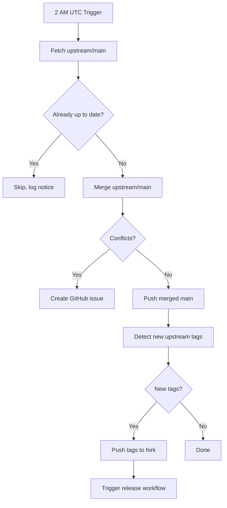

# Automated Upstream Sync Documentation

This document describes the automated upstream synchronization system for the davidvasandani/openclaw fork.

## Overview

The fork automatically syncs with [openclaw/openclaw](https://github.com/openclaw/openclaw) daily, preserving fork-specific optimizations while incorporating all upstream changes and releases.

## Components

### 1. Upstream Sync Workflow

**File:** [`.github/workflows/upstream-sync.yml`](.github/workflows/upstream-sync.yml)

**Triggers:**
- **Scheduled:** Daily at 2 AM UTC (`cron: '0 2 * * *'`)
- **Manual:** Via GitHub Actions UI or `gh workflow run upstream-sync.yml`

**What it does:**
1. Fetches latest changes from openclaw/openclaw
2. Merges upstream/main into fork's main branch
3. Syncs new upstream tags (triggers release workflow)
4. Creates GitHub issue if merge conflicts occur

**Strategy:** Uses **merge** (not rebase) to preserve fork changes and avoid repeated conflict resolution.

### 2. Enhanced Release Workflow

**File:** [`.github/workflows/release.yml`](.github/workflows/release.yml)

**Enhancements:**
- Checks if tag exists in upstream
- Includes upstream attribution in release notes
- Lists fork-specific optimizations
- Links to upstream release notes

**Triggers:**
- Push of tags matching `v*` (e.g., `v2026.2.23`)
- Manual workflow dispatch

## Fork Optimizations Preserved

The fork maintains these permanent enhancements over upstream:

### Package Size Optimization
- **From:** ~50 MB → **To:** 5.6 MB (90% reduction)
- **How:** Excluded docs, tests, and unnecessary source files
- **Files:** `package.json`, `.gitignore`

### Enhanced Plugin Loader
- **Feature:** Supports both `.ts` and `.js` extensions
- **Benefit:** Future-ready for pre-compiled extensions
- **File:** `src/plugins/loader.ts` (`resolveExtensionEntryPoint` function)

### Automated Infrastructure
- GitHub Actions workflows for releases and sync
- Daily upstream synchronization
- Tag-based automatic releases

## How It Works

### Daily Sync Process



### Tag Synchronization

When upstream creates a new release tag (e.g., `v2026.2.23`):

1. **Sync workflow detects tag** (next scheduled run or manual trigger)
2. **Tag pushed to fork** (same name as upstream)
3. **Release workflow triggers automatically**
4. **Fork release created** with:
   - Pre-built tarball (5.6 MB)
   - Fork optimizations included
   - Link to upstream release
   - Installation instructions

### Merge History

**Initial merge:** Completed on 2026-02-24
- **Commit:** [98990d8d3](https://github.com/davidvasandani/openclaw/commit/98990d8d3)
- **Conflicts resolved:**
  - `.gitignore`: Combined both versions
  - `src/agents/sandbox/docker.ts`: Took upstream version
  - `src/plugins/loader.ts`: Auto-merged successfully

**Result:** Future merges should be automatic with no conflicts.

## Manual Operations

### Trigger Sync Manually

```bash
# Via GitHub CLI
gh workflow run upstream-sync.yml --repo davidvasandani/openclaw

# Check run status
gh run list --workflow=upstream-sync.yml --repo davidvasandani/openclaw --limit 5
```

### View Sync History

```bash
# View recent runs
gh run list --workflow=upstream-sync.yml --repo davidvasandani/openclaw

# View specific run details
gh run view <run-id> --repo davidvasandani/openclaw
```

### Manual Sync (if workflow fails)

If the automated sync encounters conflicts:

```bash
# 1. Setup
cd /srv/src/openclaw  # Or your main worktree
git checkout main
git pull fork main

# 2. Add upstream and fetch
git remote add upstream https://github.com/openclaw/openclaw.git || true
git fetch upstream

# 3. Merge upstream
git merge upstream/main

# 4. Resolve conflicts (if any)
# - .gitignore: Keep both sets of entries
# - src/agents/sandbox/docker.ts: Keep fork version
# - src/plugins/loader.ts: Keep fork version

# 5. Complete merge
git add .
git commit -m "Merge upstream openclaw/openclaw"

# 6. Push to fork
git push fork main
```

## Conflict Resolution Guidelines

If conflicts occur during automated sync:

### Expected Conflicts

The fork has permanent differences that may occasionally conflict:

1. **`.gitignore`**
   - **Fork addition:** Extension build output entries
   - **Resolution:** Keep both sets, ensure `extensions/*/dist/` is present

2. **`src/plugins/loader.ts`**
   - **Fork addition:** `resolveExtensionEntryPoint` function
   - **Resolution:** Keep fork version with enhancement

3. **`package.json`**
   - **Fork changes:** Optimized `files` array
   - **Resolution:** Keep fork version (excludes docs/tests)

### Conflict Issue Template

When conflicts occur, the workflow creates a GitHub issue with:
- List of conflicting files
- Step-by-step resolution instructions
- Link to failed workflow run

## Testing

### Test Sync Workflow

```bash
# Manual trigger with force option
gh workflow run upstream-sync.yml --repo davidvasandani/openclaw \
  -f force_sync=true

# Wait and check result
sleep 30
gh run list --workflow=upstream-sync.yml --repo davidvasandani/openclaw --limit 1
```

### Verify Fork State

```bash
# Check if fork is up to date with upstream
git fetch fork
git fetch upstream
git log fork/main..upstream/main  # Should be empty or show only upstream commits

# Check merge history
git log --oneline --graph fork/main | head -20
```

## Monitoring

### Success Indicators

✅ Daily workflow runs successfully
✅ "Already up to date with upstream" message
✅ New upstream tags appear in fork within 24 hours
✅ Fork releases include all optimizations
✅ No GitHub issues created by sync workflow

### Failure Indicators

⚠️ Workflow failure notifications
⚠️ GitHub issues with "upstream-sync" label
⚠️ Tags missing from fork
⚠️ Releases not triggered automatically

### Monitoring Commands

```bash
# Check recent workflow runs
gh run list --workflow=upstream-sync.yml --repo davidvasandani/openclaw --limit 10

# Check for sync-related issues
gh issue list --repo davidvasandani/openclaw --label upstream-sync

# Compare fork to upstream
git fetch fork && git fetch upstream
git log --oneline fork/main ^upstream/main  # Fork-only commits
git log --oneline upstream/main ^fork/main  # Upstream commits not in fork
```

## Workflow Permissions

The workflows require these GitHub token permissions:

- `contents: write` - Push merged changes and tags
- `issues: write` - Create conflict notification issues (optional)

These are automatically provided by `GITHUB_TOKEN` in GitHub Actions.

## Troubleshooting

### Workflow Shows "Already Synced" But Fork is Behind

**Cause:** Merge base check is passing but upstream has new commits
**Solution:**
```bash
# Force sync
gh workflow run upstream-sync.yml --repo davidvasandani/openclaw -f force_sync=true
```

### Tags Not Syncing

**Check:**
1. Verify workflow completed successfully
2. Check tag sync step in workflow logs
3. Manually push tags if needed:
```bash
git fetch upstream --tags
git push fork --tags
```

### Merge Conflicts on Every Sync

**Cause:** Merge history not properly established
**Solution:** Re-run initial manual merge (see "Manual Sync" section)

### Release Not Triggered for Synced Tag

**Check:**
1. Verify tag exists in fork: `git ls-remote --tags fork`
2. Check release workflow runs: `gh run list --workflow=release.yml --limit 5`
3. Manually trigger: `gh workflow run release.yml`

## Architecture Decisions

### Why Merge Instead of Rebase?

**Decision:** Use merge strategy (not rebase)

**Reasoning:**
- Fork has **permanent** custom changes that will never merge upstream
- Merge preserves clear history of fork vs upstream changes
- Avoids repeated conflict resolution on same files
- Safer for automation (no force-push needed)
- Standard approach for long-term forks

### Why Daily Instead of Real-Time?

**Decision:** Schedule sync once per day at 2 AM UTC

**Reasoning:**
- Upstream doesn't release multiple times per day
- Reduces GitHub Actions quota usage
- Allows batching of changes
- Manual trigger available for urgent updates
- 24-hour delay is acceptable for this use case

### Why Sync Tags Instead of Creating Fork Tags?

**Decision:** Mirror upstream tag names exactly

**Reasoning:**
- Clear correspondence to upstream releases
- Easier to track which upstream version fork is based on
- Users can reference upstream documentation
- Simpler than maintaining separate versioning scheme

## Links

- **Fork Repository:** https://github.com/davidvasandani/openclaw
- **Upstream Repository:** https://github.com/openclaw/openclaw
- **Sync Workflow:** https://github.com/davidvasandani/openclaw/blob/main/.github/workflows/upstream-sync.yml
- **Release Workflow:** https://github.com/davidvasandani/openclaw/blob/main/.github/workflows/release.yml
- **Sync Workflow Runs:** https://github.com/davidvasandani/openclaw/actions/workflows/upstream-sync.yml
- **Release Workflow Runs:** https://github.com/davidvasandani/openclaw/actions/workflows/release.yml
- **Fork Releases:** https://github.com/davidvasandani/openclaw/releases
- **Initial Merge Commit:** https://github.com/davidvasandani/openclaw/commit/98990d8d3

## Maintenance

### When Upstream Makes Breaking Changes

If upstream makes breaking changes to files with fork modifications:

1. **Assess impact:** Review upstream changes vs fork modifications
2. **Update fork code:** Adapt fork enhancements to work with upstream changes
3. **Test locally:** Ensure all 30+ extensions still load correctly
4. **Update conflicts guide:** Add new conflict resolution steps to this doc
5. **Consider automation:** Add merge strategy hints if conflicts become repetitive

### Updating This Documentation

This document should be updated when:
- Sync workflow is modified
- New fork-specific changes are added
- Conflict resolution patterns change
- New monitoring tools are added
- Troubleshooting procedures are discovered

## History

- **2026-02-21:** Initial implementation with rebase strategy
- **2026-02-23:** Switched to merge strategy for permanent fork changes
- **2026-02-24:** Initial manual merge completed, automated sync operational

---

**Last Updated:** 2026-02-24
**Maintained By:** davidvasandani
**Status:** ✅ Operational
